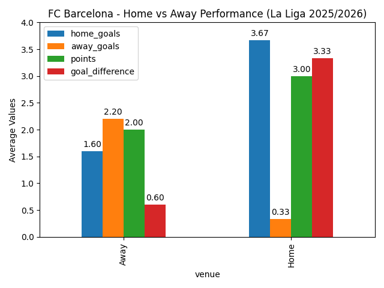
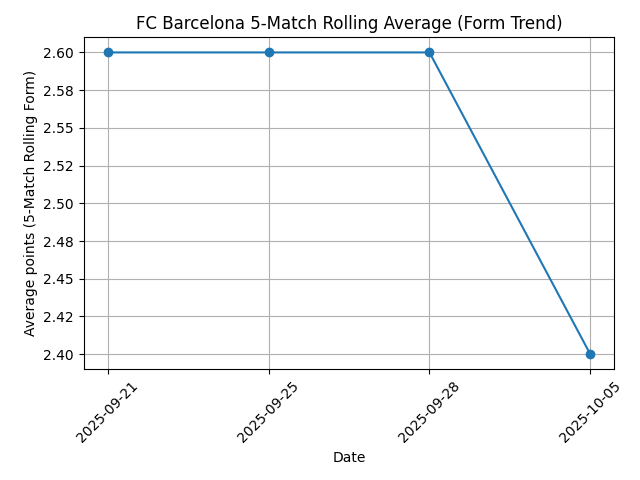

# Barça Project V1 

Python project analyzing FC Barcelona’s 2025 La Liga season using the Football-Data API.

## How to Run
```bash
pip install pandas matplotlib requests
python scripts/main.py

## Results Summary

This project analyzes FC Barcelona’s 2025 La Liga season performance using live match data from the Football-Data API. 
The script processes each game to calculate results, cumulative points, and venue type (home vs away), then visualizes 
the team’s progression throughout the season. It outputs both a CSV file of match data and a plotted graph for quick 
performance insight.



## Version 3 – Streamlit Dashboard

Version 3 turns the analysis into an interactive dashboard using **Streamlit**.  
It allows users to explore FC Barcelona’s 2025/26 season results, view charts, and monitor performance metrics without running scripts manually.

### New Features
- Interactive sidebar to switch between:
  - Cumulative Points chart  
  - Home vs Away summary  
  - 5-Match Rolling Form trend  
- Live “Season Summary” metrics:
  - Total Points  
  - Average Goals per Match  
  - Win Rate (%)  
- Data preview table for quick access to match results  
- Browser-based interface that updates automatically as new CSV data is saved  

### How to Run the Dashboard
```bash
pip install streamlit pandas matplotlib
streamlit run scripts/dashboard.py


